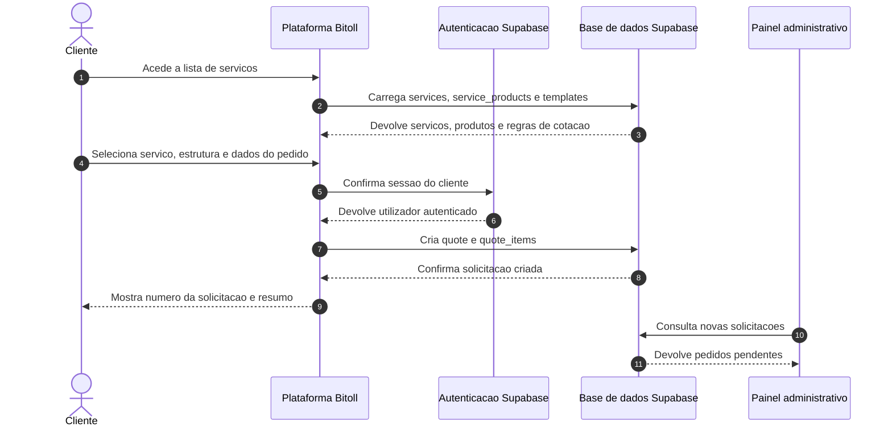
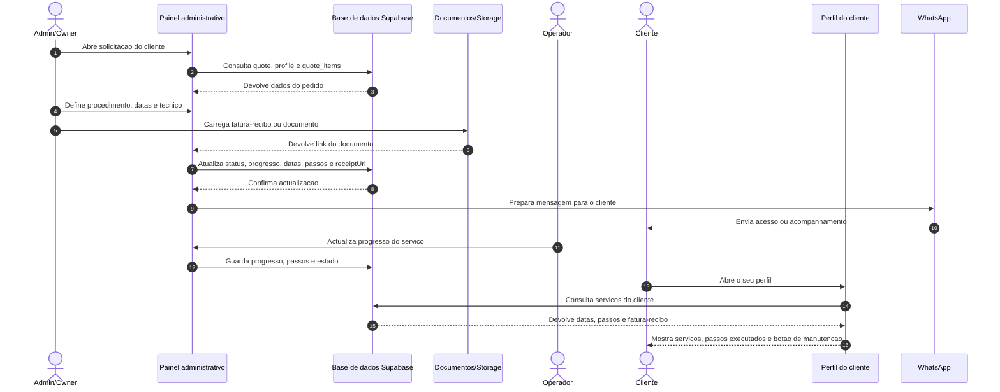
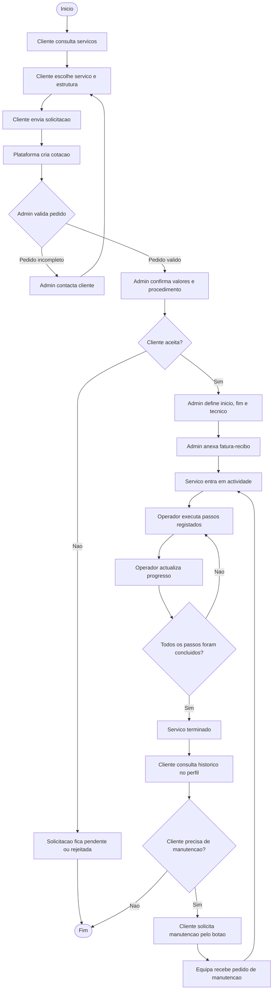
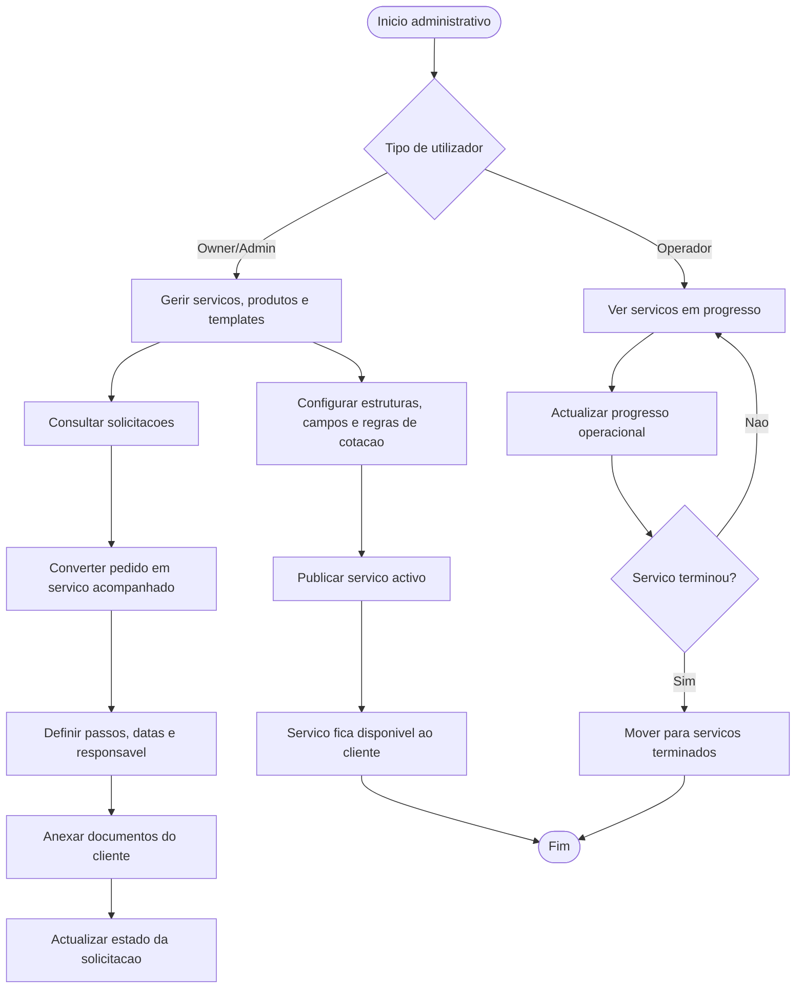
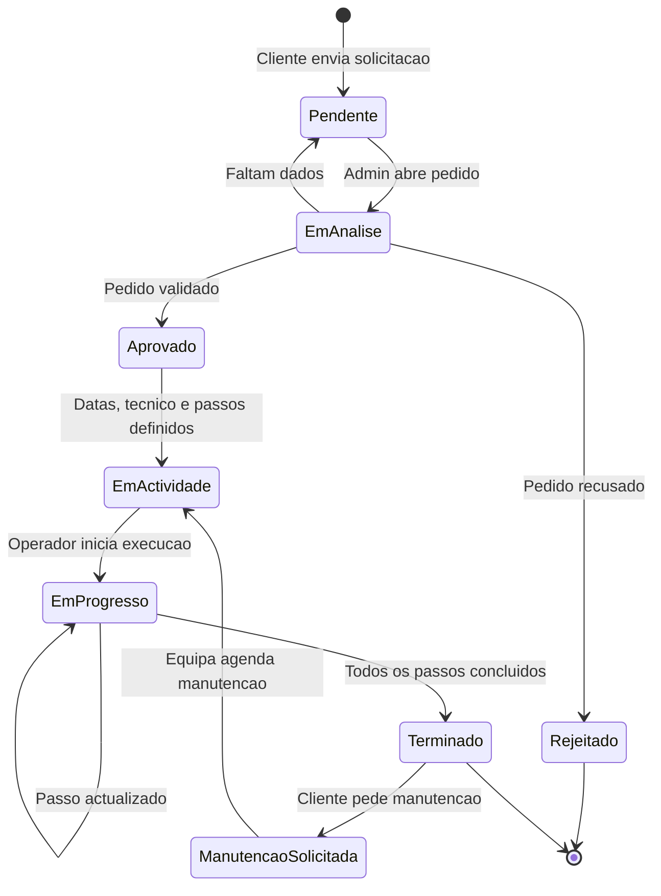
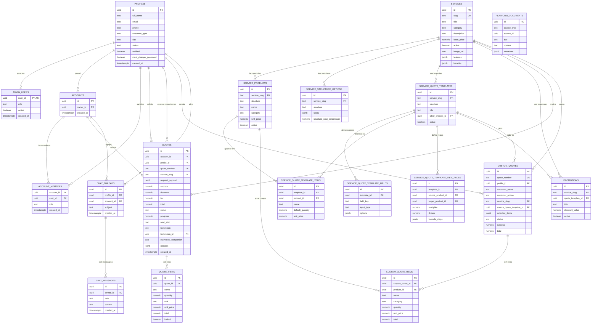

# Diagramas da plataforma Bitoll

Este documento descreve os principais fluxos e entidades da plataforma Bitoll.
Os diagramas estao em Mermaid para poderem ser visualizados no GitHub, em editores compativeis ou em ferramentas de documentacao.

## Diagrama de sequencia: solicitacao de servico pelo cliente

## Diagrama de sequencia: tratamento administrativo e acompanhamento

## Diagrama de actividade: ciclo completo do servico

## Diagrama de actividade: gestao de conteudo e operacao

## Diagrama de estados: solicitacao e servico

## Diagrama entidade-relacionamento

## Observacoes de implementacao

- Os documentos como fatura-recibo ficam representados operacionalmente por links no `request_payload` da solicitacao, enquanto os ficheiros podem viver no Storage.
- Os passos apresentados no perfil do cliente devem vir dos passos registados para execucao do servico, evitando repetir informacoes gerais da cotacao.
- A manutencao nasce a partir do servico terminado ou em acompanhamento e deve manter referencia ao cliente, solicitacao original e tipo de servico.
- A tabela `quotes` e o seu `request_payload` concentram hoje varios dados de acompanhamento: datas, passos, documento e informacoes adicionais do pedido.
